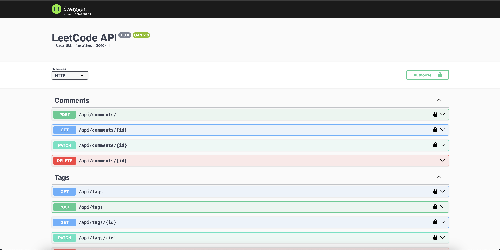

Приложение клон LeetCode. 
## Пользователи 
- `user`- рядовой пользователь, который решает задачи
- `admin` - супер пользователь обладает всеми правами
- `interviewer` - пользователь, который проверяет задачи, и оценивает выполнение их.

## Функциональные требования
Ниже представлены базовые функциональные требования, которые были описаны в поставленном проекте. 
1. `Хранение задач по программированию`, у которых есть описание, примеры входных и выходных данных, уровень сложности, теги (например, "алгоритмы", "структуры данных", "динамическое программирование"), дополнительные материалы (файлы, ссылки)
2. `Авторизация` для разных пользователей.
3. `Поддержка ролей и действий пользователей` 
		`user`
			- отставлять комментарии к задачам и обсуждать возможные решения
			- оценивать задачи
			- изменять свой профиль
		`interviewer`
			- просмотр профиля пользователя
			- редактирование рейтинга пользователя 
			- добавление/редактирование/удаление задач, тегов, категорий
		`admin` - ? (Будет дописано когда появятся требования)
4. содержать `REST API` для управления ресурсами приложения
5. `использовать базу данных` для хранения информации о задачах, пользователях

Еще видится доп функционал - проверка заданий, но пока не понятно как это будет работать, так что опционально. Будем рассматривать "клон LeetCode" как хаб с задачами. 

## Описание моделей бд сущностей

![[drawSQL-image-export-2024-11-17 (1).png]]

В качестве ORM взят пакет `prisma`

##  API
Api представлено через Swagger API.
http://localhost:3000/api-docs/

## Запуск проекта 
` npm run dev`

