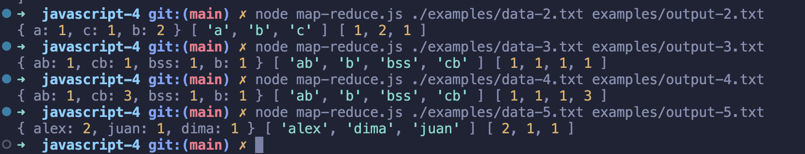

# Отладочные выводы скрипта на предоставленных примерах
 - 1 параметр - промежуточная структура
 - 2 параметр - отсортированные ключи
 - 3 параметр - результат работы 

P.S. В папке examples исходные данные и результат работы скрипта с выводом в файл.